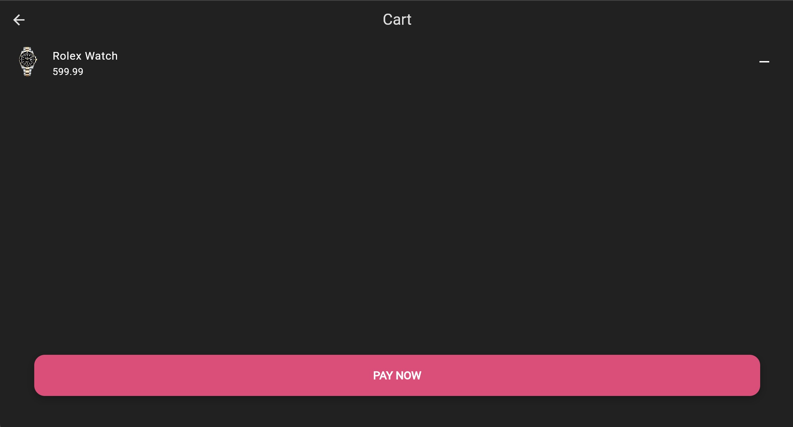

# E-commerce application

This is a simple ecommerce application that provides you with a ready-made front-end template that can be run on all platforms such as (Mobile, Windows, Web). Coded by Kareem Saad using Flutter framework while considering important concepts and features such as Responsive and adaptive UI, Reusable and organized code structure, Dark and light theme.
## ⚙️Installation
- Download project from repo
```bash
git clone https://github.com/samekeekz/e-commerce-flutter.git
```
- Navigate to the project directory
```bash
cd Mimal-Shop-app
```
- Install dependencies
```bash
flutter pub get
```
- Run the app
```bash
flutter run
```
## 📸 screenshots
<p align="center">
    
    
    
    
    
</p>
